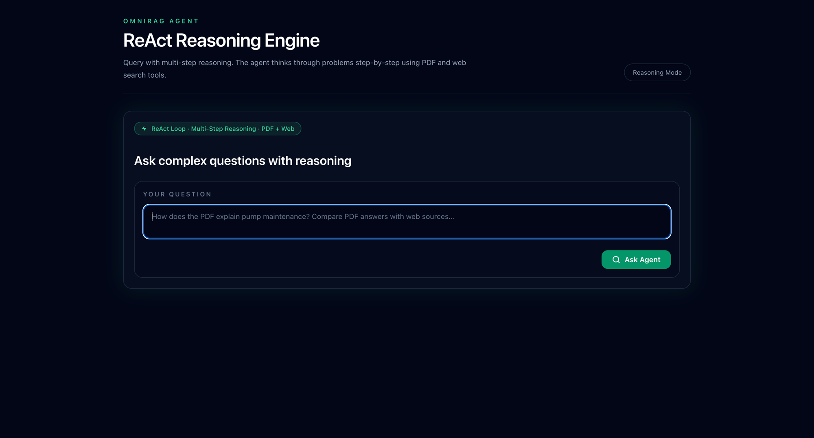
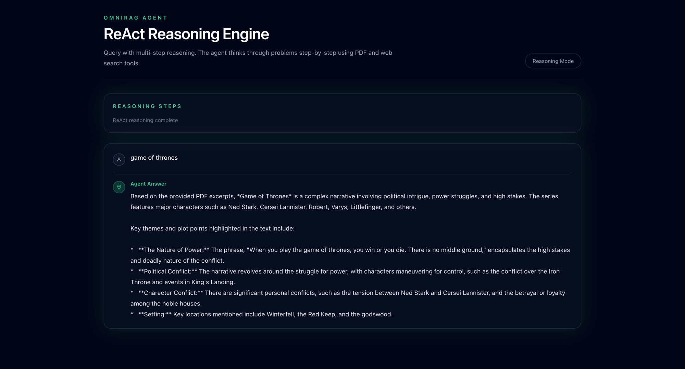

# OmniRAG Agent — ReAct Loop with PDF & Web Search

A Go-based ReAct agent endpoint that uses multi-step reasoning with Ollama. It automatically chooses between PDF search (primary) and web search (fallback) tools to answer questions.

## Features

- **ReAct Loop**: Structured reasoning with Thought → Action → Observation cycles
- **PDF-First Strategy**: Prefers PDF search results, uses web as fallback
- **Retry Logic**: Automatic retries with exponential backoff (configurable max retries)
- **Step Limit**: Max steps safeguard prevents infinite loops
- **Token Control**: Configurable max_tokens on Ollama calls
- **Graceful Degradation**: Returns best answer found if max steps hit (not an error)
- **Clean UI**: Matches existing OmniRAG theme with Tailwind dark mode

## Screenshots

**Query Interface** — Ask complex questions with multi-step reasoning:



**Reasoning Output** — See step-by-step reasoning and final answers:



## UI Features

The web interface at `http://localhost:8082/agent` provides:

- **Dark Theme**: Matches OmniRAG's sleek emerald-on-black design
- **Query Input**: Textarea for complex multi-step questions
- **Real-time Feedback**: Visual indicators while reasoning
- **Step Visibility**: Shows ReAct reasoning steps as they execute
- **Formatted Answers**: Final answer with source context
- **Error Handling**: User-friendly error messages
- **Keyboard Shortcuts**: `Cmd+Enter` / `Ctrl+Enter` to submit

## Configuration

Edit `config.json`:

```json
{
  "OLLAMA_HOST": "http://localhost:11434",
  "OLLAMA_MODEL": "gemma4:e4b",
  "TAVILY_API_KEY": "your-api-key",
  "MAX_STEPS": 10,
  "MAX_RETRIES": 3,
  "MAX_TOKENS": 1024,
  "SEARCH_ENDPOINT": "http://localhost:8081/api/search"
}
```

- **OLLAMA_HOST**: Local Ollama instance URL
- **OLLAMA_MODEL**: Model to use for reasoning
- **TAVILY_API_KEY**: API key for web search (get from https://tavily.com)
- **MAX_STEPS**: Max ReAct loop iterations
- **MAX_RETRIES**: Retry failed HTTP calls up to this many times
- **MAX_TOKENS**: Token limit per Ollama call
- **SEARCH_ENDPOINT**: URL of your PDF search endpoint

## API Endpoints

### POST /api/agent/query

**Request:**
```json
{
  "query": "How does the PDF explain pump maintenance?"
}
```

**Response:**
```json
{
  "answer": "The final answer from the agent's reasoning..."
}
```

### GET /agent

Web UI page for interactive queries.

## Running

```bash
# Build
go build -o agent main.go

# Run on port 8082 (default)
./agent

# Run on custom port
./agent -port 8080
```

Server logs will show:
```
Agent server listening on http://localhost:8082
Endpoint: POST http://localhost:8082/api/agent/query
UI: http://localhost:8082/agent
```

## Tools

The agent has access to two tools:

### search_pdf
- Primary tool for factual questions
- Calls your PDF search endpoint
- Returns matched chunks from vector DB
- Tool description emphasizes PDF-first preference

### web_search
- Fallback for info not in PDF
- Uses Tavily API for web search
- Only called if PDF results insufficient
- Returns top 3 web results

## System Prompt

The agent's behavior is guided by a system prompt that:
1. Positions PDF as primary source
2. Positions web as fallback only
3. Requires ReAct format: Thought → Action → Observation
4. Enforces step limits
5. Prompts for "Final Answer" format

## Guardrails

1. **Max Steps**: Stops loop at `MAX_STEPS`, returns best answer so far
2. **Retry Logic**: HTTP calls retry up to `MAX_RETRIES` times with backoff
3. **Timeout Safe**: Single Ollama call timeout handled gracefully
4. **Token Control**: Every Ollama request respects `MAX_TOKENS`

## Tool Descriptions

Tool prompts are carefully crafted to guide the LLM:

- `search_pdf` description emphasizes it's the "primary source" with "grounded facts"
- `web_search` description indicates it's for "additional context" or "verification"
- System prompt explicitly prioritizes PDF-first approach

## UI Features

- Dark theme matching OmniRAG retrieval UI
- Real-time answer display
- Reasoning step indicator
- Error handling with user-friendly messages
- Keyboard shortcut: `Cmd+Enter` / `Ctrl+Enter` to submit

## Example Queries

```
"How does the PDF explain pump maintenance? What are the main steps?"
"What does section 4.2 cover? Check if there are related articles online."
"Compare the PDF's approach with current industry standards online."
```

## Integration

To integrate with your existing setup:

1. Update `SEARCH_ENDPOINT` to point to your `/api/search` endpoint
2. Set `TAVILY_API_KEY` if you want web search enabled
3. Ensure Ollama is running on `OLLAMA_HOST`
4. Run agent on a different port than your main API (default 8082)

Your main app can:
- Call `/api/agent/query` for programmatic access
- Link to `/agent` for the web UI
- Proxy both endpoints if on different hosts

## Documentation

- **[SETUP.md](docs/SETUP.md)** - Build, run, configure, deploy (Docker/nginx/systemd), troubleshoot
- **[DFD.md](docs/DFD.md)** - Full data flow diagram (Mermaid) — exact services and transformations at every step
- **[TOOLS_ARCHITECTURE.md](docs/TOOLS_ARCHITECTURE.md)** - Tool interface, how to add new tools, design decisions
- **[LOGGING.md](docs/LOGGING.md)** - Log prefixes and how to debug the ReAct loop
- **[PDF_ENDPOINT_SSE_FORMAT.md](docs/PDF_ENDPOINT_SSE_FORMAT.md)** - Real SSE payload format from the search endpoint
