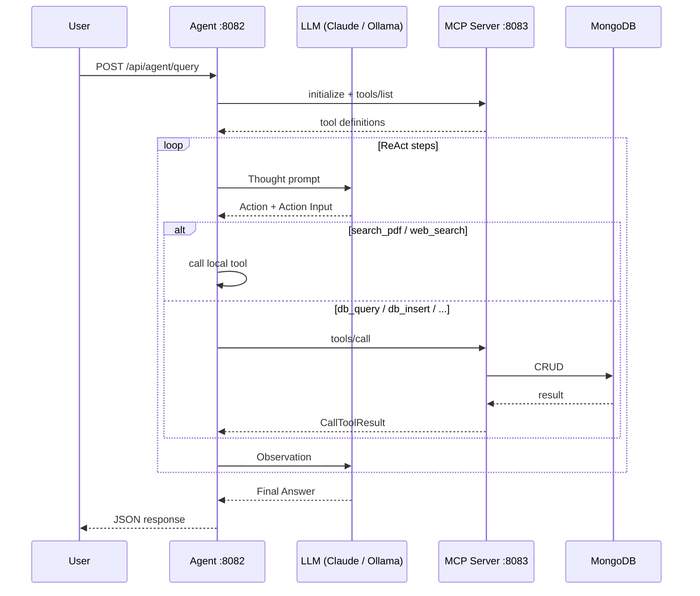

# agentic-ai

A local agentic AI system built in Go. An LLM-powered ReAct agent that reasons over PDF documents, the web, and a MongoDB database — all wired together via the Model Context Protocol (MCP).

The agent runs fully local on Ollama by default, and can transparently switch to Anthropic Claude when an API key with credits is configured — no code change required.

---

## Repository Structure

```
agentic-ai/
├── agents/   — ReAct agent (Ollama/Anthropic + PDF search + web search + MCP client)
└── mcp/      — MongoDB MCP server (exposes agentic_mcps DB as MCP tools)
```

---

## Architecture

```mermaid
graph TD
    subgraph agentic-ai
        subgraph agents
            A[ReAct Agent<br/>:8082]
            T1[search_pdf tool]
            T2[web_search tool]
            T3[MCP client tools<br/>discovered via tools/list]
        end

        subgraph mcp
            M[MCP Server<br/>:8083 / SSE]
            DB[(MongoDB<br/>agentic_mcps)]
            C1[learning_todo]
            C2[links_tracker]
            C3[job_portals]
        end
    end

    LLM[LLM Backend<br/>Anthropic Claude or Ollama] -->|ReAct loop| A
    A --> T1 --> PDF[PDF Search<br/>:8081]
    A --> T2 --> Web[Tavily Web Search]
    A --> T3 -->|MCP over SSE| M
    M -->|CRUD| DB
    DB --> C1
    DB --> C2
    DB --> C3
```



---

## How it works



---

## Modules

### [`agents/`](./agents/)
ReAct loop agent powered by Anthropic Claude or a local Ollama model. On startup it connects to the MCP server, calls `tools/list` to discover available DB tools, and builds the system prompt dynamically from each tool's own schema.

Every tool owns its complete definition (`name`, `description`, `input_schema`) via a `Schema()` method — the tool registry compiles these into the prompt, so descriptions live in exactly one place per tool (no hardcoded prompt text).

| Tool | Source |
|---|---|
| `search_pdf` | Local PDF vector search endpoint |
| `web_search` | Tavily API |
| `list_collections`, `query_documents`, `insert_document`, `update_document`, `delete_document` | Discovered from MCP server at runtime |

**LLM backend selection** — Anthropic is used only when `ANTHROPIC_API_KEY`, `ANTHROPIC_MODEL`, and `ANTHROPIC_CREDIT_BALANCE: true` are all set in `config.json`; otherwise it falls back to local Ollama. See [`agents/README.md`](./agents/README.md) for details.

### [`mcp/`](./mcp/)
Standalone MCP server exposing a MongoDB database over HTTP/SSE. Any MCP-compatible client (Claude Desktop, Cursor, or a custom agent) can connect to it — no agent-specific coupling.

SSE endpoint: `http://localhost:8083/sse`

---

## Quick Start

```bash
# 1. Create your local configs from the examples (they hold API keys, so they are gitignored)
cp agents/config.example.json agents/config.json
cp mcp/config.example.json   mcp/config.json
# then fill in your keys (Tavily, optionally Anthropic) in agents/config.json

# 2. Start MongoDB
mongosh --eval "db.adminCommand({ping:1})"

# 3. Start the MCP server
cd mcp && go run .

# 4. Start the agent
cd agents && go run .

# 5. Query the agent
curl -X POST http://localhost:8082/api/agent/query \
  -H "Content-Type: application/json" \
  -d '{"query": "What is stored in my database?"}'
```

> **Config & secrets:** `config.json` is gitignored in both modules because it contains API keys. Commit only `config.example.json` with placeholder values.

---

## Prerequisites

| Dependency | Purpose |
|---|---|
| Go 1.21+ | Build both modules |
| MongoDB | Backing store for MCP server |
| Ollama | Local LLM inference (default backend) |
| Anthropic API key | Optional — cloud LLM backend (Claude) |
| Tavily API key | Web search fallback |
| PDF search endpoint | Optional — `http://localhost:8081/api/search` |
