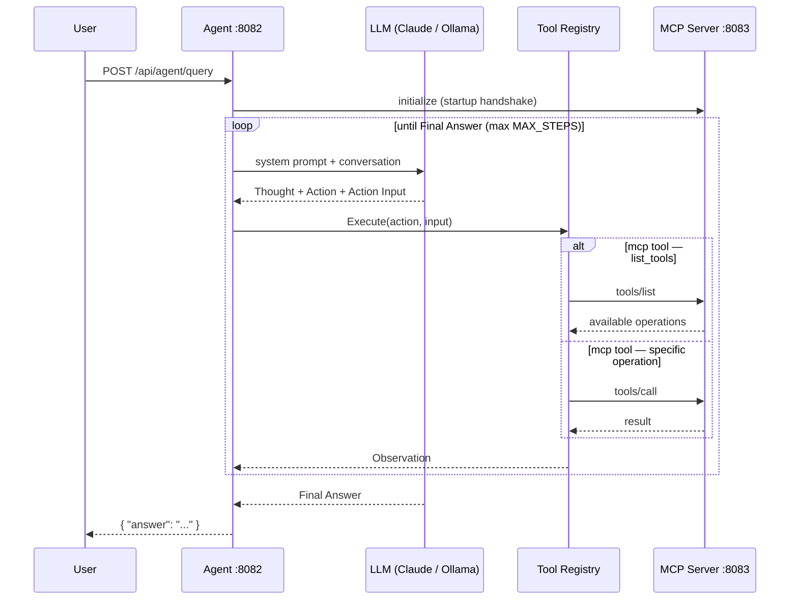

# agents — ReAct Agent

An LLM-powered [ReAct](https://arxiv.org/abs/2210.03629) (Reason + Act) agent written in Go. It loops `Thought → Action → Observation` over a set of tools until it can produce a `Final Answer`. The agent has three tools: local PDF vector search, Tavily web search, and a single `mcp` tool that reaches the [MCP server](../mcp/) — its operations are discovered at runtime via the standard protocol.

The LLM backend is pluggable: it runs on local **Ollama** by default and switches to **Anthropic Claude** when configured — with no code change.

<p align="center">
  
</p>

---

## ReAct Loop



---

## File Layout

The service is split into focused files (one responsibility each):

| File | Responsibility |
|---|---|
| `main.go` | Entry point — backend selection, tool registry wiring, MCP connection, HTTP server |
| `config.go` | `Config` struct, loads `config.json` at startup |
| `types.go` | `AgentRequest`, `AgentResponse`, `ReActState` |
| `llm.go` | `LLMCaller` interface + `OllamaCaller` + `AnthropicCaller` |
| `react.go` | `runReAct()` — the Thought/Action/Observation loop |
| `server.go` | HTTP handlers (`/api/agent/query`, static files) |
| `tools/` | Tool registry and tool implementations |

### `tools/` package

| File | Responsibility |
|---|---|
| `tools.go` | `Tool` interface, `ToolSchema`, `Manager` (the registry) |
| `pdf_search.go` | `search_pdf` tool — local PDF vector search endpoint |
| `web_search.go` | `web_search` tool — Tavily API |
| `mcp_client.go` | MCP client — connects, lists, and calls MCP tools |
| `mcp_tool.go` | The single `mcp` tool exposed to the agent |
| `errors.go` | Shared error helpers |

---

## Tool Schema Registry

Each tool owns its **complete** definition through a `Schema()` method, returning the standard JSON tool-definition shape used by OpenAI, Anthropic, and MCP:

```go
func (t *PDFSearchTool) Schema() ToolSchema {
    return ToolSchema{
        Name:        "search_pdf",
        Description: "Search the user's PDF documents. Use this FIRST for any factual questions...",
        InputSchema: map[string]any{
            "type": "object",
            "properties": map[string]any{
                "query": map[string]any{"type": "string", "description": "..."},
            },
            "required": []string{"query"},
        },
    }
}
```

The `Manager` is the registry/compiler:
- `Register(tool)` — adds a tool, preserving registration order
- `Schemas()` — returns all schemas in order
- `BuildPromptSection()` — compiles schemas into the system-prompt tool list

This means a tool's description lives in exactly one place — the tool's own file — and is never duplicated in the prompt. The `mcp` tool's schema describes only the protocol (an `action` field); the server's individual operations are discovered at query time via `action: list_tools`, so the server stays the single source of truth for DB operations.

---

## LLM Backend Selection

Anthropic is used **only** when all three are set in `config.json`:

```jsonc
"ANTHROPIC_API_KEY": "sk-ant-...",     // present
"ANTHROPIC_MODEL":   "claude-haiku-4-5-20251001", // present
"ANTHROPIC_CREDIT_BALANCE": true        // explicitly true
```

Otherwise the agent falls back to local Ollama. The `ANTHROPIC_CREDIT_BALANCE` flag lets you keep the key in config but force Ollama (e.g. when the Anthropic account is out of credits) by flipping it to `false`.

Both backends implement the same interface:

```go
type LLMCaller interface {
    Call(system, user string) (string, error)
    ModelName() string
}
```

---

## Configuration

Copy the example and fill in your keys (`config.json` is gitignored):

```bash
cp config.example.json config.json
```

| Key | Description |
|---|---|
| `OLLAMA_HOST` | Ollama server URL (default backend) |
| `OLLAMA_MODEL` | Ollama model name, e.g. `gemma4:e4b` |
| `TAVILY_API_KEY` | Tavily key for `web_search` |
| `MAX_STEPS` | Max ReAct iterations per query |
| `MAX_RETRIES` | Tool call retry count |
| `MAX_TOKENS` | LLM max output tokens |
| `SEARCH_ENDPOINT` | PDF search endpoint URL |
| `MCP_SERVER_URL` | MCP server base URL (SSE at `/sse`) |
| `ANTHROPIC_API_KEY` | Optional — Anthropic key |
| `ANTHROPIC_MODEL` | Optional — Claude model id |
| `ANTHROPIC_CREDIT_BALANCE` | `true` to use Anthropic, `false` to force Ollama |

---

## Run

```bash
# from agents/
go run .            # default port 8082
go run . -port 9000 # custom port
```

On startup you'll see the chosen backend and the registered tools:

```text
[LLM] Backend: Ollama (gemma4:e4b)
[MCP] Registered MCP tool (LLM will discover resources dynamically)
[MAIN] Tool registry: 3 tools
Agent server listening on http://localhost:8082
```

---

## API

### `POST /api/agent/query`

Request:
```json
{ "query": "What information do I have stored in my database?" }
```

Response:
```json
{ "answer": "..." }
```

The agent reasons over its tools (PDF search → web search → MCP DB tools) and returns the final answer once the ReAct loop produces a `Final Answer`. A web UI is served at `http://localhost:8082`.
