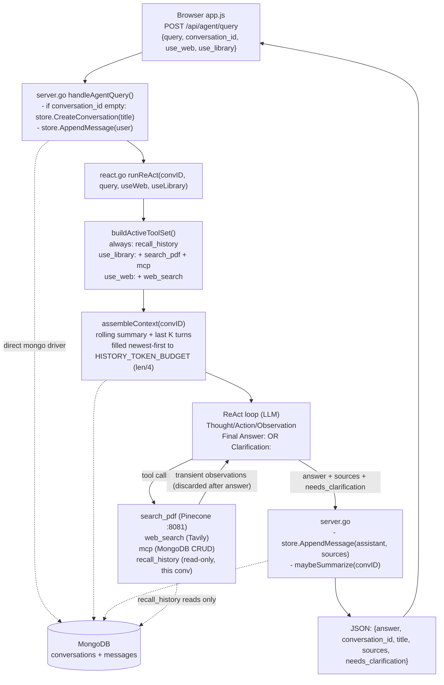

# Data Flow Diagram — OmniRAG Agent

> **Note:** This project is pure Go. No LangChain, no text splitter library.  
> Tokenization happens **inside Ollama's model** (gemma4 BPE tokenizer) — not in application code.

---

## Full Request Flow

```mermaid
flowchart TD
    U["User types query in browser"]
    U -->|"POST /api/agent/query\nContent-Type: application/json\nbody: {query: 'How does pump maintenance work?'}"| A

    A["agentic-ai · main.go\nhandleAgentQuery()\nDecodes JSON → AgentRequest.Query"]
    A --> B

    B["agentic-ai · main.go\nrunReAct()\nstrings.Join: system_prompt + 'User question: ' + query"]
    B -->|"POST http://localhost:11434/api/generate\nmodel: gemma4:e4b  stream: false\noptions.num_predict: 1024 (from config.json MAX_TOKENS)"| C

    C["Ollama · gemma4:e4b\nInternal BPE tokenizer splits full prompt\nGenerates: Thought + Action + Action Input"]
    C -->|"response string"| D

    D["agentic-ai · main.go\nGo regexp parser\nactionRe extracts 'search_pdf' or 'web_search'\ninputRe extracts the query string"]

    D -->|"action = search_pdf"| E
    D -->|"action = web_search"| K

    %% ─── PDF Path ──────────────────────────────────────────────
    E["agentic-ai · tools/pdf_search.go\nExecute(query)\nPOST http://localhost:8081/api/search\nbody: {query: '...'}"]

    subgraph OmniRAG ["Omni-RAG · retrieval/main.go (port 8081)"]
        direction TB
        R1["handleSearch()\nDecodes JSON → SearchRequest.Query"]
        R1 -->|"POST http://localhost:11434/api/embed\nmodel: gemma4:e2b\nbody: {input: [query string]}"| R2

        R2["Ollama · gemma4:e2b\nInternal BPE tokenizer splits query\nOutputs: 768-dimensional float32 vector\n[0.123, -0.456, 0.789, ... × 768]"]

        R2 -->|"embeddings[0] — []float32 len=768"| R3

        R3["Omni-RAG · PineconeQuerier.Query()\nPOST https://pinecone-host/query\nbody: {vector:[...], topK:3, includeMetadata:true}"]

        R3 -->|"JSON: {matches:[{id, score, metadata{text_content, page_number, chapter}}]}"| R4

        R4["Omni-RAG · main.go\nPineconeQuerier parses matches\nBuilds []SourceMatch structs"]

        R4 -->|"[]SourceMatch — top 3 chunks"| R5

        R5["Omni-RAG · buildPrompt()\nAssembles string:\n  [System Instruction] + [Context Chunks] + [User Question]"]

        R5 -->|"POST http://localhost:11434/api/generate\nmodel: gemma4:e4b  stream: true"| R6

        R6["Ollama · gemma4:e4b\nInternal BPE tokenizer splits full RAG prompt\nStreams answer tokens one-by-one"]

        R6 -->|"NDJSON lines: {response: 'token', done: false}"| R7

        R7["Omni-RAG · OllamaStreamer.Stream()\nsseWrite() emits per token:\n  event: stage\n  event: token\n  event: sources\n  event: done"]
    end

    E -->|"SSE stream response"| OmniRAG
    OmniRAG -->|"SSE: event:sources\ndata:{sources:[{text_content, score, page_number}]}"| F

    F["agentic-ai · tools/pdf_search.go\nbufio.Scanner reads SSE line by line\nLooks for 'event: sources'\nParses data: JSON → extracts text_content fields"]

    F -->|"[PDF_SUCCESS|Found N chunks]\n+ joined text_content strings"| G
    F -->|"[PDF_EMPTY|No matching documents]"| G

    %% ─── Web Search Path ────────────────────────────────────────
    K["agentic-ai · tools/web_search.go\nExecute(query)\nPOST https://api.tavily.com/search\nbody: {query, max_results:3, api_key}"]

    K -->|"JSON: {results:[{url, content, title}]}"| L

    L["agentic-ai · tools/web_search.go\nExtracts url + content from each result\nBuilds observation string"]
    L -->|"web results text"| G

    %% ─── Loop Back ───────────────────────────────────────────────
    G["agentic-ai · main.go  runReAct()\nmessages = append(messages, 'Observation: ' + result)"]

    G -->|"response has no 'Final Answer:'\nAND step count < MAX_STEPS (10)"| B

    G -->|"response contains 'Final Answer:'\nOR step count >= MAX_STEPS"| H

    H["agentic-ai · main.go\nstrings.Split on 'Final Answer:'\nstate.Answer = trimmed right side"]

    H -->|"HTTP 200  Content-Type: application/json\nbody: {answer: '...'}"| Z

    Z["Browser · app.js\ndata = await resp.json()\ncard.textEl.textContent = data.answer"]
```

---

## Who Does What (Quick Reference)

| Step | Service / File | What it does to the data |
|------|---------------|--------------------------|
| 1 | Browser `app.js` | Wraps user text into `{query: "..."}` JSON |
| 2 | `agentic-ai/main.go handleAgentQuery()` | Decodes JSON, passes raw string to `runReAct()` |
| 3 | `agentic-ai/main.go runReAct()` | Prepends `"User question: "` label, joins with system prompt via `strings.Join` |
| 4 | **Ollama `gemma4:e4b` BPE tokenizer** | Splits full prompt into subword tokens, generates `Thought/Action/Action Input` text |
| 5 | `agentic-ai/main.go` Go regexp | Parses action name and input string from LLM output |
| 6a | `agentic-ai/tools/pdf_search.go` | HTTP POST to Omni-RAG `/api/search` |
| 7 | `Omni-RAG/retrieval/main.go handleSearch()` | Receives query string |
| 8 | **Ollama `gemma4:e2b` BPE tokenizer** | Splits query into subword tokens, outputs 768-dim float32 vector |
| 9 | `Omni-RAG PineconeQuerier.Query()` | Sends vector to Pinecone, gets top-3 cosine similarity matches |
| 10 | `Omni-RAG buildPrompt()` | Assembles: system instruction + 3 source chunks + user question into one string |
| 11 | **Ollama `gemma4:e4b` BPE tokenizer** | Splits RAG prompt into tokens, generates answer token by token |
| 12 | `Omni-RAG OllamaStreamer.Stream()` | Emits SSE events: `stage → token × N → sources → done` |
| 13 | `agentic-ai/tools/pdf_search.go` | `bufio.Scanner` reads SSE, extracts `text_content` from `event: sources` |
| 14 | `agentic-ai/main.go` | Appends `"Observation: " + result` to message history, loops or exits |
| 15 | `agentic-ai/main.go` | Splits on `"Final Answer:"`, returns answer string |
| 16 | Browser `app.js` | Renders `data.answer` into the DOM |

---

## Key Point on Tokenization

There is **no text splitter library** (no LangChain, no recursive character splitter) in this project.

The word "tokenization" refers to what **Ollama's BPE tokenizer** does **internally**:
- `gemma4:e2b` tokenizes the query before embedding it
- `gemma4:e4b` tokenizes the full prompt before generating a response

Application code never sees individual tokens — it only sends a string in and gets a string (or vector) back.

If text splitting were added (e.g., splitting a long document before indexing), it would appear in the **ingestion pipeline**, not the retrieval pipeline shown here.

---

## Your Library Knowledge Base — request flow (toggles + memory)

The single-shot flow above is now wrapped in conversation handling. Source selection
is explicit via two UI toggles, and conversation history is persisted to MongoDB by a
**direct Go driver** in `agents/` (NOT the MCP tool). See PLAN and
`docs/API_ENDPOINTS.md`, `docs/CONVERSATION_STORAGE_FORMAT.md`, `docs/RECALL_HISTORY_TOOL.md`.

### Key points
- **Source gating:** the active tool set is rebuilt every request from the toggles.
  Both off → only `recall_history`; the model answers from its own knowledge and
  suggests enabling 🌐 Web if it can't.
- **Memory layer separation:** `conversations`/`messages` are written **only** by the
  backend's direct driver. The model's `mcp` CRUD tool (incl. `delete_document`) is a
  different layer and is gated behind My Library.
- **Transient observations:** Pinecone/web text is never stored; only final answers are
  persisted. Replay uses the budgeted summary + last-K turns.
- **Clarify-back:** if the model emits `Clarification:` (e.g. ambiguous book), it exits
  the loop with `needs_clarification=true` and the text is shown as the assistant turn.
