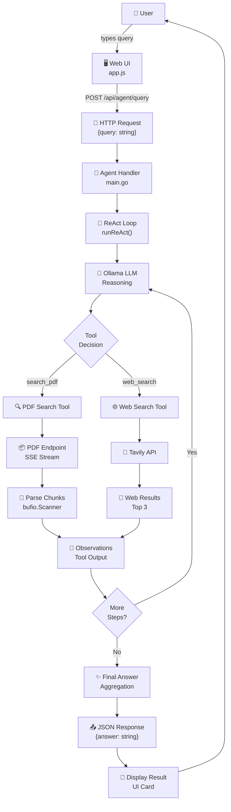
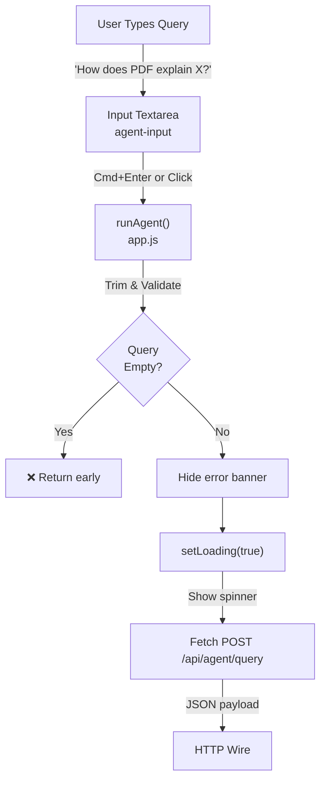
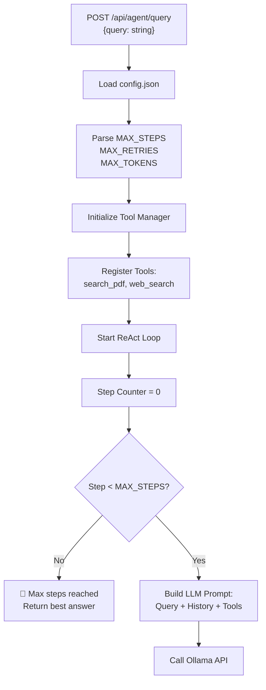
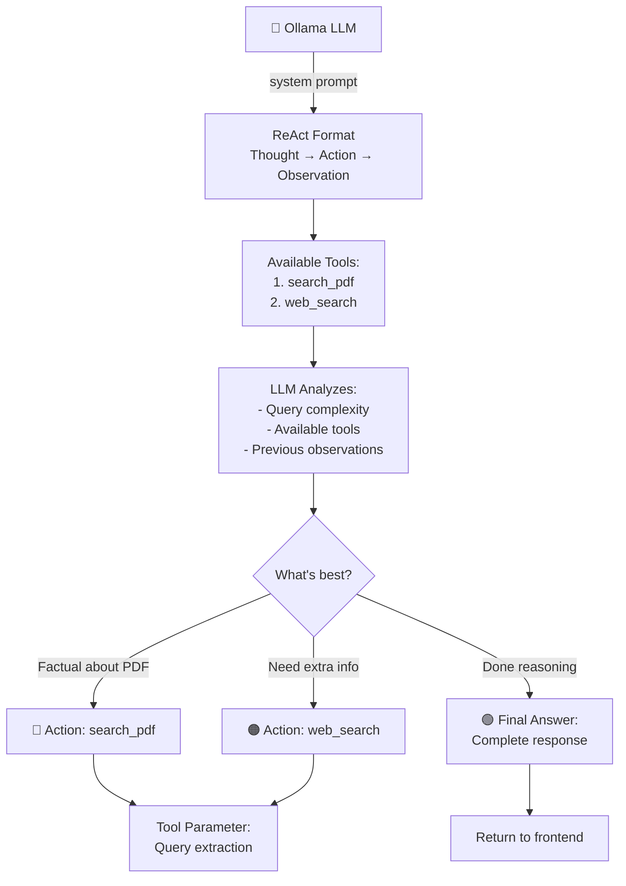
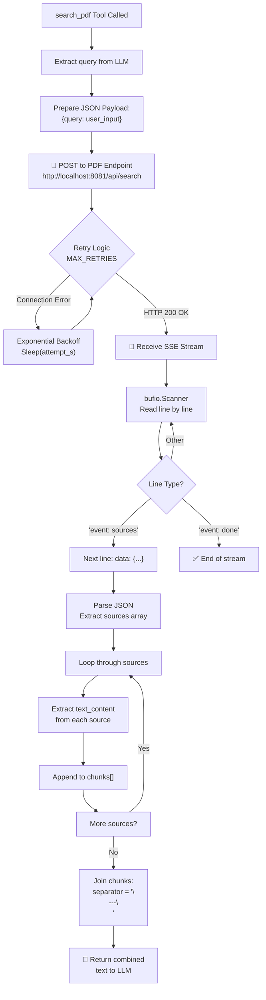
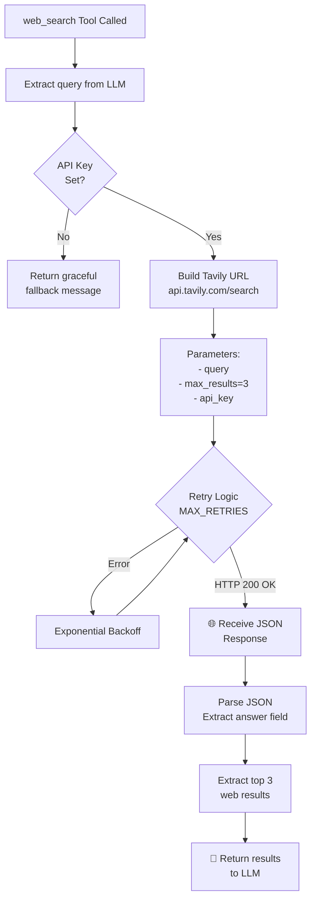
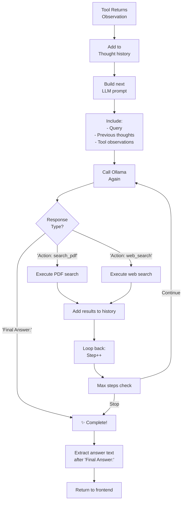
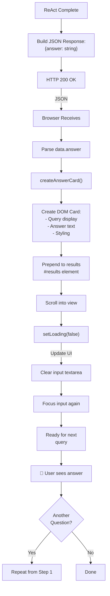

# ReAct Agent Data Flow Diagram

Complete flow showing how user queries move through the ReAct reasoning loop with tool execution.

## High-Level Flow



## Detailed Step-by-Step Flow

### 1️⃣ User Query Submission



### 2️⃣ Server-Side ReAct Loop



### 3️⃣ LLM Decision & Tool Selection



### 4️⃣ PDF Search Tool Execution



### 5️⃣ Web Search Tool Execution



### 6️⃣ ReAct Loop Continuation



### 7️⃣ Response & Frontend Display



## Data Structures

### Request Payload
```json
{
  "query": "How does the PDF explain pump maintenance?"
}
```

### PDF Endpoint Response (SSE Stream)
```
event: sources
data: {"sources": [{"text_content": "...", "page": 42}, ...]}

event: done
data: {}
```

### Final API Response
```json
{
  "answer": "Based on the PDF excerpts, pump maintenance involves..."
}
```

### ReAct Loop State (Internal)
```json
{
  "step": 3,
  "max_steps": 10,
  "query": "...",
  "thoughts": ["Thought 1...", "Thought 2..."],
  "actions": ["Action: search_pdf", "Action: web_search"],
  "observations": ["Found PDF chunks...", "Web results..."],
  "current_reasoning": "LLM output..."
}
```

## Key Decision Points

| Decision | Logic |
|----------|-------|
| Tool Selection | LLM analyzes query & chooses tool based on description priority |
| Retry Decision | Automatic backoff if HTTP error (max 3 retries) |
| Loop Continuation | Check if LLM says "Final Answer" or step count exceeds MAX_STEPS |
| Graceful Degradation | If web_search key missing, return helpful message instead of error |

## Performance Notes

- **PDF Search Latency**: Depends on vector DB query time (streaming reduces timeout risk)
- **LLM Latency**: Ollama response time (respects MAX_TOKENS limit)
- **Web Search Latency**: Tavily API response (typically <1s for top 3 results)
- **Total Loop Time**: Sum of tool calls + LLM reasoning (typically 5-15s for 2-3 steps)

## Error Handling

```
User Query
    ↓
[Network Error] → Retry with backoff → [Success] OR [Final Retry] → Error Banner
    ↓
[LLM Error] → Return error message
    ↓
[Tool Failure] → Skip tool, try alternative
    ↓
[Max Steps Hit] → Return best answer so far (NOT an error)
```
