# Complete Query Pipeline DFD

What ACTUALLY happens to user's query - from text to answer.

## User Query Pipeline (Full End-to-End)

```mermaid
graph LR
    A["👤 User Input<br/>Query Text"] -->|"Raw query string"| B["🔤 Tokenization<br/>Break into tokens"]
    B -->|"Token stream"| C["✂️ Text Splitter<br/>Chunk into sentences"]
    C -->|"Sentence chunks"| D["🧠 Embedding Model<br/>Ollama /api/embed"]
    D -->|"Vector<br/>dim=768"| E["🔍 Vector Search<br/>Pinecone Query"]
    E -->|"Top K matches<br/>+ scores"| F["📄 Retrieve Chunks<br/>With metadata"]
    F -->|"Text chunks<br/>+ citations"| G["📝 Build Prompt<br/>RAG context"]
    G -->|"System + Context<br/>+ Question"| H["🤖 LLM Generation<br/>Ollama /api/generate"]
    H -->|"Token stream"| I["💬 Stream to User<br/>Real-time display"]
    I -->|"Final answer<br/>+ sources"| J["✨ User sees<br/>Answer with citations"]
```



## Detailed Step-by-Step Flow

### Step 1: User Input
```
User types: "How does the PDF explain pump maintenance?"
Raw input: string
```

### Step 2: Text Tokenization
```
Input: "How does the PDF explain pump maintenance?"
Process: Break into tokens using embedding model's tokenizer
Output: [How, does, the, PDF, explain, pump, maintenance, ?]
```

### Step 3: Text Splitting (If not done in Step 1)
```
Input: Full user query (usually just 1 sentence)
Process: May be split if very long (>512 tokens)
Output: Same query (usually unchanged for short inputs)
Purpose: Prepare for embedding model token limit
```

### Step 4: Vectorization/Embedding
```
Request to Ollama:
  POST http://localhost:11434/api/embed
  {
    "model": "gemma4:e2b",
    "input": ["How does the PDF explain pump maintenance?"]
  }

Process: Convert text to dense vector
Output: 
  {
    "embeddings": [[0.123, -0.456, 0.789, ..., 0.012]]  // 768 dimensions
  }

Vector: 768-dimensional representation of semantic meaning
```

### Step 5: Vector Database Search
```
Request to Pinecone:
  POST https://pinecone-host/query
  {
    "vector": [0.123, -0.456, 0.789, ..., 0.012],
    "topK": 3,
    "includeMetadata": true,
    "namespace": "default"
  }

Process: Find K most similar vectors in database
Similarity: Cosine distance between vectors
Output:
  {
    "matches": [
      {
        "id": "chunk_123",
        "score": 0.998,
        "metadata": {
          "text_content": "Pump maintenance involves checking pressure...",
          "source_file_id": "manual_v2",
          "page_number": 45,
          "chapter": 3
        }
      },
      {
        "id": "chunk_124",
        "score": 0.876,
        "metadata": { ... }
      },
      { ... }
    ]
  }
```

### Step 6: Chunk Retrieval with Metadata
```
Retrieved chunks from vector DB:
  1. Score: 0.998 → "Pump maintenance involves checking pressure gauge..."
  2. Score: 0.876 → "Regular maintenance reduces downtime by..."
  3. Score: 0.755 → "Tools needed: wrench, gauge, sealant..."

Metadata attached:
  - source_file_id (document ID)
  - page_number (location)
  - chapter (section)
  - text_content (actual excerpt)
```

### Step 7: Build RAG Prompt
```
System Prompt:
  "You are a technical assistant. Answer using ONLY the context provided.
   If not found, say 'I don't know'."

Context Block (from chunks):
  --- Source 1 (Score: 0.998) ---
  "Pump maintenance involves checking pressure gauge, oil level, and seals.
   Steps: 1) Turn off power, 2) Release pressure, 3) Inspect components..."
  
  --- Source 2 (Score: 0.876) ---
  "Regular maintenance reduces downtime by 40% and extends equipment life."

User Question:
  "How does the PDF explain pump maintenance?"

Full Prompt (sent to LLM):
  [System Instruction]
  [Context Content from chunks]
  [User Question]
```

### Step 8: LLM Generation (Streaming)
```
Request to Ollama:
  POST http://localhost:11434/api/generate
  {
    "model": "gemma4:e4b",
    "prompt": "[full RAG prompt from Step 7]",
    "stream": true,
    "options": {
      "num_predict": 1024,
      "temperature": 0.7
    }
  }

Response (streamed tokens):
  Token 1: "Based"
  Token 2: " on"
  Token 3: " the"
  Token 4: " provided"
  Token 5: " PDF"
  Token 6: " excerpts"
  Token 7: ","
  Token 8: " pump"
  Token 9: " maintenance"
  Token 10: " involves..."

Final answer accumulated:
  "Based on the provided PDF excerpts, pump maintenance involves checking
   the pressure gauge, verifying oil levels, and inspecting seals.
   The process requires: 1) Turn off power, 2) Release pressure safely,
   3) Inspect each component for wear or damage..."
```

### Step 9: Stream to User
```
Real-time display in UI:
  As tokens arrive: "Based", "Based on", "Based on the", ...
  
Cursor animation: "Based on the provided PDF excerpts▋"
Updates in real-time as LLM generates
```

### Step 10: Final Answer with Citations
```
Display to user:
  ✓ Complete answer
  ✓ Source citations (3 sources shown)
    - Source 1: 100% match, Chapter 3, Page 45
    - Source 2: 98% match, Chapter 4, Page 51
    - Source 3: 88% match, Chapter 5, Page 67
  
  Ready for next query
```

## Where Vectorization Happens

### Text Processing Path:
```
Raw Text Chunks (in Vector DB)
    ↓
[Pre-loaded into Pinecone at ingestion time]
    ↓
Each chunk: "Pump maintenance involves..."
    ↓
Embedding Model: Ollama /api/embed
    ↓
Vector: [0.123, -0.456, 0.789, ...]  768-dim
    ↓
Stored in Pinecone Vector DB
    ↓
On Query:
    User Input → Embedding Model → Same vector space
    ↓
Cosine similarity search → Top K matches
```

### Vectorization Workflow:
```
Ingestion Time (happens once per document):
  PDF → Extract text chunks → Split into 512-token chunks
      → For each chunk:
        - Send to Ollama /api/embed
        - Get 768-dim vector
        - Store in Pinecone with metadata

Query Time (happens per user query):
  User query → Same embedding model → Same vector space
            → Query Pinecone for nearest neighbors
            → Retrieve top K chunks by similarity
            → Reconstruct context → Send to LLM
```

## Data Flow Diagram with Models

```
INGESTION PIPELINE (One-time, when PDFs uploaded):
┌─────────────────┐
│ PDF Document    │
│ (raw bytes)     │
└────────┬────────┘
         │
         ▼
┌─────────────────────────────────────┐
│ Text Extraction & Chunking          │
│ Split into ~512 token chunks        │
│ Add metadata (page, chapter, etc)   │
└────────┬────────────────────────────┘
         │
         ▼
┌─────────────────────────────────────┐
│ FOR EACH CHUNK:                     │
│                                      │
│  Chunk text → Ollama /api/embed     │
│  Model: gemma4:e2b                  │
│  Output: 768-dimensional vector     │
└────────┬────────────────────────────┘
         │
         ▼
┌─────────────────────────────────────┐
│ Store in Pinecone Vector Database   │
│ {                                    │
│   id: "chunk_123",                  │
│   vector: [...768 floats...],       │
│   metadata: {                        │
│     text_content: "...",            │
│     source_file_id: "doc_xyz",      │
│     page_number: 45,                │
│     chapter: 3                      │
│   }                                  │
│ }                                    │
└─────────────────────────────────────┘


QUERY PIPELINE (Per user question):
┌──────────────────────────┐
│ User Input Query         │
│ "How does PDF explain.." │
└────────┬─────────────────┘
         │
         ▼
┌──────────────────────────────────────┐
│ Vectorize Query                      │
│ Query → Ollama /api/embed            │
│ Same model as ingestion              │
│ Output: Same 768-dim vector          │
└────────┬─────────────────────────────┘
         │
         ▼
┌──────────────────────────────────────┐
│ Vector Search in Pinecone            │
│ Find 3 chunks with highest cosine    │
│ similarity to query vector           │
│ Returns: metadata + vectors + scores │
└────────┬─────────────────────────────┘
         │
         ▼
┌──────────────────────────────────────┐
│ Build RAG Prompt                     │
│ Context = top 3 chunks +metadata     │
│ Full prompt = system + context + q   │
└────────┬─────────────────────────────┘
         │
         ▼
┌──────────────────────────────────────┐
│ LLM Generation (Streaming)           │
│ Ollama /api/generate                 │
│ Model: gemma4:e4b                    │
│ Stream tokens in real-time           │
└────────┬─────────────────────────────┘
         │
         ▼
┌──────────────────────────────────────┐
│ Stream to User UI                    │
│ Display answer token-by-token        │
│ Show citations from sources          │
└──────────────────────────────────────┘
```

## Key Models & Services

| Component | Service | Model | Endpoint |
|-----------|---------|-------|----------|
| **Text Embedding** | Ollama | `gemma4:e2b` | `/api/embed` |
| **Answer Generation** | Ollama | `gemma4:e4b` | `/api/generate` |
| **Vector Database** | Pinecone | (custom index) | `https://[host]/query` |
| **Chunking** | (ingestion) | - | - |
| **Tokenization** | Embedding model | Built-in | - |

## What Gets Vectorized

1. **At Ingestion Time:**
   - Each text chunk from PDF
   - Chunks are ~512 tokens max
   - Metadata (page, chapter, etc) NOT vectorized (stored separately)

2. **At Query Time:**
   - User's question/query
   - Same embedding model as chunks
   - Ensures query and chunks are in same vector space

3. **NOT Vectorized:**
   - Metadata (handled by vector DB)
   - Images (only text currently)
   - Structured data (handled separately)

## Return Path

```
LLM Output → Streamed tokens → UI Display
                             ↓
                         [Answer visible]
                             ↓
                         Sources shown
                             ↓
                         User can click for details
```

This shows the **complete pipeline** from raw query to final answer!
