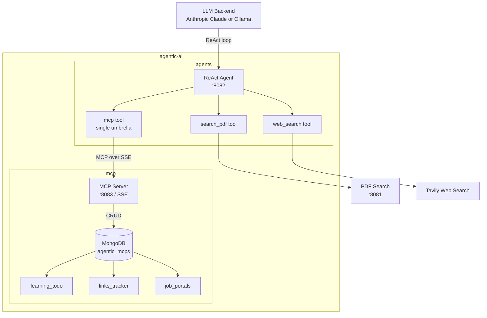
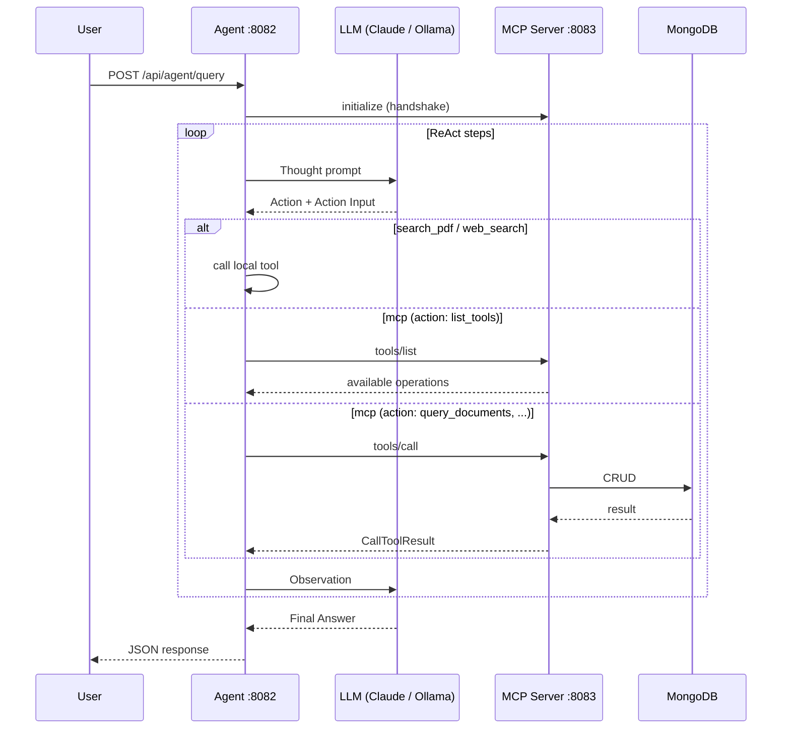

# Architecture

The system is two independent Go services wired together over the Model Context Protocol (MCP):

- **`agents/`** — the ReAct agent (LLM brain + tools)
- **`mcp/`** — a standalone MongoDB MCP server

The agent treats MCP as a black-box protocol: it knows only that there is **one** `mcp` tool, and discovers what that server can do at runtime via the standard `tools/list` action.

---

## System Overview

---

## How a Query Flows

---

## Design Principles

| Principle | What it means |
|---|---|
| **MCP as a black box** | The agent has a single `mcp` tool. It does not pre-register individual MongoDB operations — it discovers them at query time via `action: list_tools`. |
| **Tool schema registry** | Every tool owns its complete definition (`name`, `description`, `input_schema`) through a `Schema()` method. The registry compiles these into the system prompt — no hardcoded prompt text. |
| **Pluggable LLM backend** | Ollama by default; Anthropic Claude when configured. Both implement the same `LLMCaller` interface. |
| **Standard protocol** | The MCP server speaks plain MCP over SSE — any client (Claude Desktop, Cursor, custom agent) can connect with no special coupling. |

---

## Ports

| Service | Port | Endpoint |
|---|---|---|
| Agent | `8082` | `POST /api/agent/query`, UI at `/` |
| MCP server | `8083` | SSE at `/sse` |
| PDF search | `8081` | `POST /api/search` (external) |

---

See **[Agents](./agents)** and **[MCP](./mcp)** for module-level detail.
