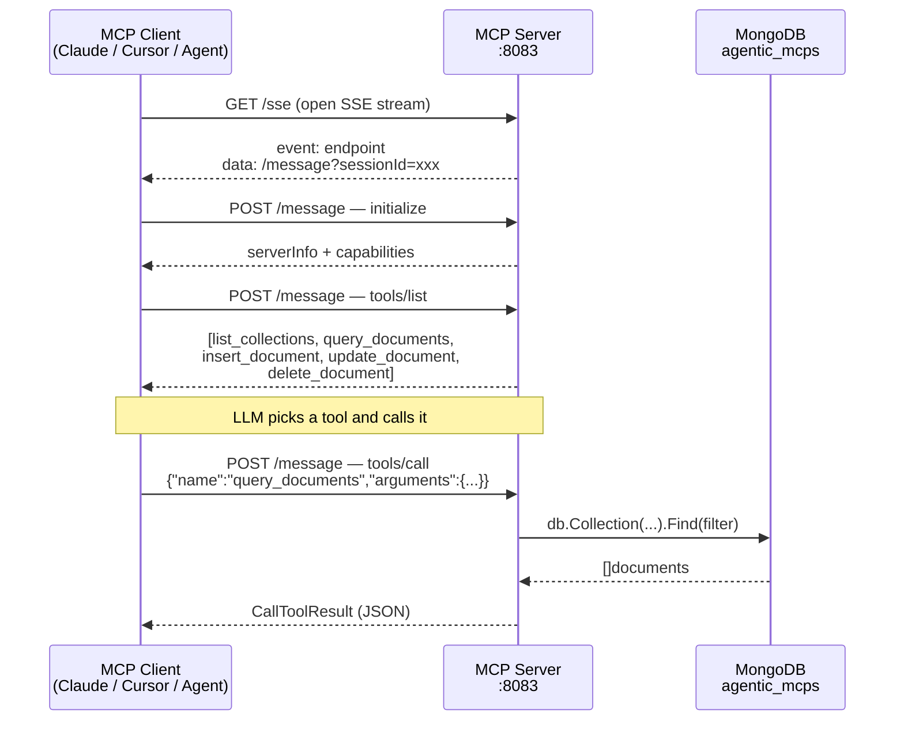

# MCP — MongoDB MCP Server

A standalone [Model Context Protocol](https://modelcontextprotocol.io) server written in Go that exposes a MongoDB database as MCP tools. Any MCP-compatible client (Claude Desktop, Cursor, custom agents) can connect to it.

The server is **general-purpose**: it stores whatever you want. The tools operate on any collection and any document shape — nothing is hardcoded to a particular schema. The collections listed below are just the example data currently in this database; create your own and the same tools work unchanged.

---

## Flow



---

## Tools

All tools are discovered dynamically by clients via `tools/list`.

| Tool | Description | Required inputs |
|---|---|---|
| `list_collections` | List all collections with document counts | — |
| `query_documents` | Query documents with optional filter | `collection` |
| `insert_document` | Insert a new document | `collection`, `document` |
| `update_document` | Update matching documents | `collection`, `filter`, `update` |
| `delete_document` | Delete matching documents | `collection`, `filter` |

### Example inputs

```jsonc
// query_documents
{"collection": "job_portals", "filter": {"Category": "Free"}, "limit": 10}

// insert_document
{"collection": "learning_todo", "document": {"Name": "Study MCP", "Status": "To Do"}}

// update_document
{"collection": "learning_todo", "filter": {"Name": "Study MCP"}, "update": {"Status": "Done"}}

// delete_document
{"collection": "learning_todo", "filter": {"Name": "Study MCP"}}
```

---

## Configuration

Copy the example to create your local config (`config.json` is gitignored):

```bash
cp config.example.json config.json
```

`config.json`:
```json
{
  "MONGO_URI": "mongodb://localhost:27017",
  "PORT": "8083"
}
```

---

## Connecting Clients

### Claude Desktop

Add to `~/Library/Application Support/Claude/claude_desktop_config.json`:
```json
{
  "mcpServers": {
    "agentic-mcps": {
      "url": "http://localhost:8083/sse"
    }
  }
}
```

### Cursor

Add to `.cursor/mcp.json` in your project:
```json
{
  "mcpServers": {
    "agentic-mcps": {
      "url": "http://localhost:8083/sse"
    }
  }
}
```

### Any MCP client

SSE endpoint: `http://localhost:8083/sse`

The server speaks standard MCP over SSE — no custom headers or auth required.

---

## Example Collections

These are the collections that happen to live in this database right now — they illustrate the kind of data you can store, but the server is not limited to them. Add any collection you like and the tools above work the same way.

| Collection | Documents | Schema |
|---|---|---|
| `learning_todo` | 16 | `Name`, `Assign`, `Status`, `Target end date` |
| `links_tracker` | 26 | `Task name`, `Assignee`, `Date`, `Description`, `Due date`, `Effort level`, `Priority`, `Status`, `Task type`, `URL` |
| `job_portals` | 68 | `Name`, `Category`, `Link`, `Link Type`, `Remarks/Findings`, `Web Description` |

---

[← Home](./) · [Architecture](./architecture) · [Agents](./agents) · [Quick Start](./quickstart)
